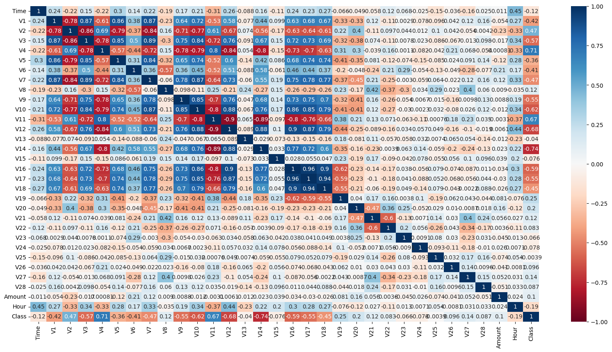

# Credit Card Fraud Detection

ML project classifying credit card transactions as real or fake using [Kaggle dataset](https://www.kaggle.com/datasets/mlg-ulb/creditcardfraud).

Ensure that you have GIT LFS installed in order to download the dataset.

# Project structure

The file `data/creditcard.csv` contains the dataset with all 285.000 transactions. 

The folder `code/` contains the different notesbooks and python scripts for the project.

# Introduction

Sadly, finance and fraud are two words that are deeply intertwined. When there is substantial monetary gain available, malicious actors will attempt to carve out a piece. Ever since the Diner Club's card in 1951, the convenience presented by credit cards has led to substantial growth, so much so that in 2021, 581 billion credit card transactions were processed.  

When choosing a dataset to work on, it seemed natural to pick an area with which we were familiar. Since almost everyone carries a credit card, both interpreting the data and understanding important metrics to measure came naturally. What is most fascinating with the dataset is its real-world applicability, meaning, what we are learning in this course is being applied to solve a real (big!) problem. However, it comes with its trade-offs, mainly that all features are anonymized, named v1-v28 (making it more difficult to draw conclusions).  

The impact of implementing and having good models to detect financial (in this case credit card) fraud is broad. If a model can detect a criminal's transactions, huge societal problems, e.g., money laundering, can be thwarted. Furthermore, fraudulent transactions are a cost for the banks/institutions handling it, meaning it shows up as a cost on their income statement, something more often than not pushed down to consumers (us), in the form of higher transaction fees / higher interest rates etc.  

Finally, with the world becoming increasingly digitalised, more data can be tied to each transaction. In machine learning, more data points and more features allows for better models, i.e., better detection of fraud. The future of finance will no doubt continue to become more data driven, why this project serves as a solid stepping stone for understanding how machine learning ties into tomorrow's systems.  

# Methods

## Data Exploration
* **Data Overview**\
Firstly, the data was explored, identifying the number of features, what they mean, what our dependent variable should be, and if there's any imbalance.
* **Duplicate Data Entries**\
Secondly, the dataset was checked for duplicate entries, and removed if any were found.
* **Null Data**\
Thirdly, the dataset is checked for null values, and if encountered, the affected rows are dropped.

## Data Preprocessing
* **Data Scaling**\
Firstly, every feature was investigated to see if any transformation was needed. Afterwards, using plots of each feature, it's decided what type of scaling to use, either standardization or min-max scaling.
* **Feature Selection**\
Secondly, kde-plots were used to determine how well each feature distinguished fraud and non-fraud. Furthermore, a correlation matrix was used to find the correlation between variables, and thereupon deciding to drop features not contributing to the prediction.
* **Train Set, Test Set**\
Lastly, the dependent value's frequency is investigated, to decipher if over/undersampling would be needed before training a model.

## Models

* **Model 1 - Logistic Regression**\
The first model was [Logistic Regression](./code/firstModel.ipynb), with the hyperparameter max_iterations set to 1200. Two methods of altering complexity were used to find differences in the model's performance:
  1. PCA - decreasing complexity through dimensionality reduction.
  2. Polynomial features - adding complexity by introducing more features.

* **Model 2 - K-Nearest Neighbors**\
The second model used was [K-Nearest Neighbors](code/knn.ipynb) (KNN). Two parameters were investigated to plot fitting graphs:
  1. PCA - decreasing complexity through dimensionality reduction.
  2. K-value - testing different k-values (different number of neighbors)

* **Model 3 - Gaussian Naive Bayes**\
The third model used was [Gaussian Naive Bayes](code/NaiveBayes.ipynb).

## Evaluation
In evaluating the train and test set, two methods of measuring model accuracy were used:
  1. Confusion Matrix
  2. Classification Report

This was done using the built in methods in sklearn.metrics, as demonstrated below:
```python
from sklearn.metrics import classification_report
from sklearn.metrics import confusion_matrix

print(classification_report(y_test, yhat))
cm = confusion_matrix(y_test, yhat)
disp = ConfusionMatrixDisplay(confusion_matrix=cm, display_labels=['Non-fraud', 'Fraud'])
disp.plot()
```

# Results

## Data exploration
* **Data Overview**\
\
The dataset contains transactions made by credit cards in September 2013 by European cardholders. This dataset presents transactions that occurred in two days, where we have 492 frauds out of 284,807 transactions. \
It contains 30 numerical input variables (V1, V2 … V28, Time, Amount). \
The variable ‘Class’ is the dependent variable (1 = fraud, 0 = not fraud) our model will predict.
* **Duplicate Data Entries**\
There were 1081 duplicate samples, all of which were removed.
* **Null Data**\
No null data was encountered, therefore, no rows were dropped in this stage.

## Preprocessing
* **Data Scaling**\
It was found that the features ‘Time’ and ‘Amount’ have large numerical values, which are different from other features. \
‘Time’ is the number of seconds elapsed between this transaction and the first transaction in the dataframe, spanning 48 hours. Therefore, another column ‘Hour’ was added, based on ‘Time’, as ‘Hour’ shows the peak period of credit card usage and its relation to the time of credit card fraud.
Since the data is not normally distributed, min-max normalization on the data was done, resulting in the variables now having values between 0 and 1, simplifying further analysis.

* **Feature Selection**\
Because of the imbalanced nature of the data, both an undersampled and oversampled correlation matrix were investigated. It was found that they were similar, i.e., sampling had no affect on correlation between variables.\
\
Using kde plots and correlation matrices, it was inferred that Time, V13, V15, V22, V23,V24,V25,V26, V27,V28, Amount, V8, V21 cannot distinguish fraud cases and non-fraud cases well, and thus were dropped.

* **Train Set, Test Set**\
As previously mentioned, there's way more non-fraud data than fraud data. We choose to oversample the fraud data here. If we undersample, we will suffer the risk of losing important information since undersample means we only utilize a tiny fraction of the non-fraud data. In addition, compared to the whole dataset, the minority class does not have sufficient size. Therefore, we will oversample.

## Model 1 - Logistic Regression
* **Comparing Train and Test Error**\
\
In the classification report for the training data, the precision was lower (91% compared to 97%) for class 0, whilst recall was higher (97% vs 90% for class 1). Regarding the f1-score they remained largely the same, with scores of 94% and 93% respectively.\
\
Meanwhile, the test data's classification report showed a large difference in precision and recall for the two classes. Class 0 had a precision of 100% and a recall of 97%, whilst class 1 had a precision of 4% with a recall of 86%. The f1-scores were 98% and 8% respectively.

* **The model's position on a fitting graph**\
As mentioned in the Methods section, two methods of altering complexity were used two find differnences in the model's performance: PCA, and Polynomial features.\
\
From the PCA-analysis, the fitting graph shows that using 7 principal components decreased the model's complexity adequatly whilst still retaining a low training/test loss.\
\
Using different degrees of polynomial features, it became evident that adding complexity using polynomial features only decreased training loss with test loss remaining largely the same. 

## Model 2 - K-nearest neighbors
Starting with PCA, it was found that 13 was the optimal number of principal components (as seen in the fitting graph below).

Regarding the optimal k-value from a fitting-perspective, the value 7 optimized the model's performance.

Evaluation


# Discussion
## Data exploration
* **Data Overview**\
This can be because of the lack of unique identyfiers in the database where the data was obtained. We will remove them because multiple identical samples can lead to biased model, which favors this subset of samples.

## Preprocessing
* **Data Scaling**\
 We can find out if frauds are more likely to happen at a spesific time of the day.\

* **Train Set, Test Set**\
Specifically, we will use 'SMOTE' (from online resources, ‘SMOTE’ may achieve higher recall). Recall is a good performance metric with our model since we want to detect as many fraud cases as possible to protect people's properties. It is awful if our model identifies a fraud case as a non-fraud case, and then people will lose money and they may need to contact the bank for further actions. \
Notice that we will oversample the train set after train test split because we want to test the model on UNSEEN test data.

### Logistic regression
The stark difference in error can be explained by the imbalanced nature of the input data, i.e., it contains way more non-fraudulent transactions than fraudulent ones.\
With a high recall being the most important metric in evaluating the model, and the test data having a recall of 84%, the conclusion was drawn that the model is not optimal for the classification problem at hand.

Therefore, introducing polynomial features is inadequate, as it increases the model's risk of overfitting (pushing the model further out on the x-axis of a fitting graph).

# Conclusion

# Collaboration
Firstly, a general collaboration statement: All individuals were active in the group discord, providing input when questions arose, discussing choices of models, meeting times, workload distribution, etc.

# References
* https://stackoverflow.com/questions/55104819/display-count-on-top-of-seaborn-barplot
* https://seaborn.pydata.org/generated/seaborn.kdeplot.html
* https://stackoverflow.com/questions/69513501/seaborn-plot-displot-with-hue-and-dual-y-scale-twinx
* https://stackoverflow.com/questions/24500065/closing-matplotlib-figures
* https://towardsdatascience.com/smote-fdce2f605729
